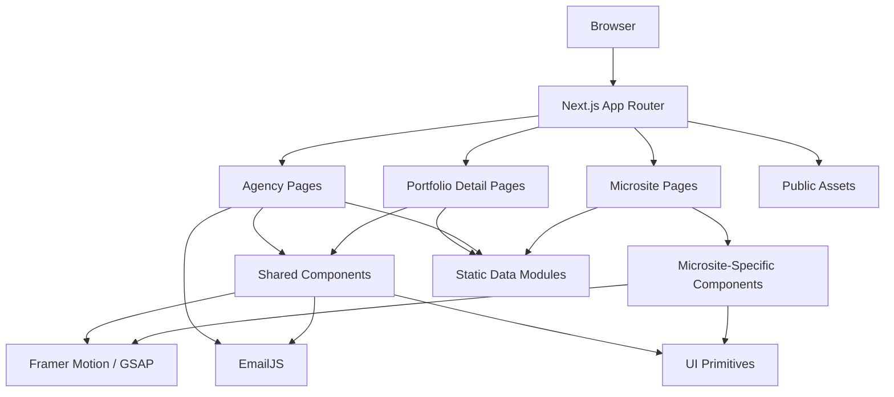
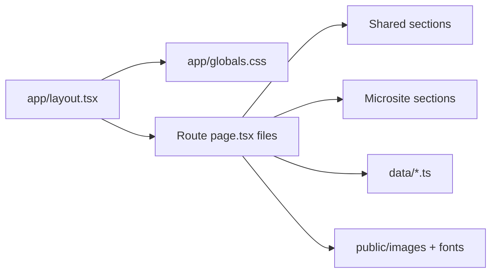
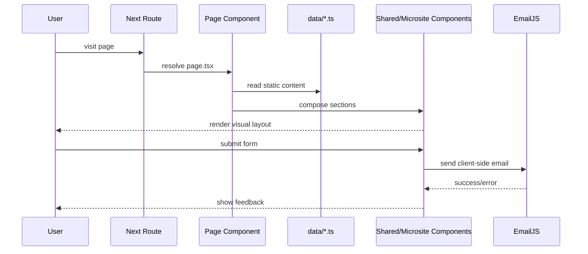
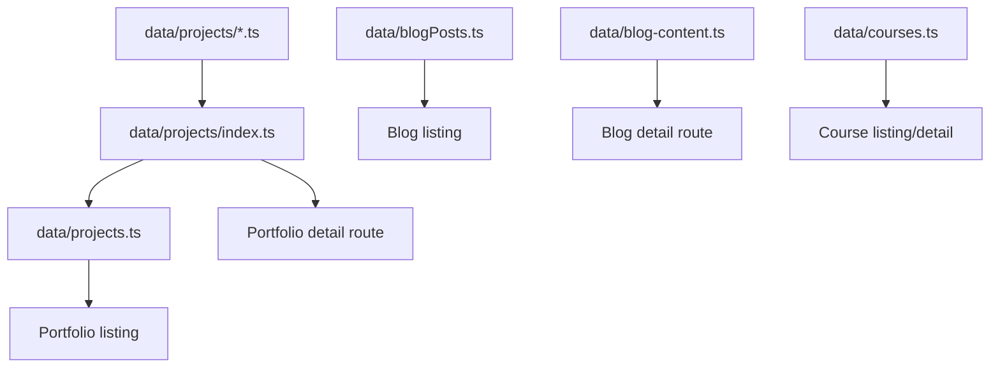

# Pixelsphere Creative Codebase and Website Layout Review

## Executive Summary

Pixelsphere Creative is a **frontend-heavy Next.js App Router application** that serves two roles inside one repository:

1. **The agency website** for Pixelsphere Creative itself
2. **A portfolio of themed showcase microsites** representing vertical solutions:
   - African Food Store
   - Beauty Hub
   - Drip & Grind
   - EdTech Platform
   - Hope Foundation
   - Real Estate Pro
   - Chopify branding showcase

The codebase is visually ambitious, image-rich, and strongly design-led. It uses modern React patterns and a solid Tailwind-based design system foundation, but it also carries notable structural debt:

- very large page files
- duplicated navigation/footer systems
- build safety checks disabled
- heavy client-side rendering
- mostly static data with no CMS or backend domain layer

The application is best described as a **multi-experience marketing and portfolio frontend** rather than a full-stack platform.

---

## Repository Snapshot

### Top-Level File Distribution

- `.tsx`: 112 files
- `.ts`: 21 files
- `.js`: 2 files
- `.css`: 2 files
- `.md`: 2 files
- media assets in `public/`: 338 files, mostly `.png` and `.jpg`

### Top-Level Directory Footprint

- `app/`: 50 files
- `components/`: 70 files
- `data/`: 13 files
- `public/`: 338 files
- `__tests__/`: 2 files
- `lib/`: 1 file

This is a content- and asset-heavy frontend codebase with relatively little infrastructure code.

---

## Languages, Frameworks, and Tooling

### Languages

- TypeScript
- TSX
- JavaScript
- CSS
- JSON
- Markdown
- ES module config (`.mjs`)

### Core Frameworks and Libraries

- **Next.js 14.2.16**
- **React 18**
- **TypeScript**
- **Tailwind CSS 3**
- **Framer Motion**
- **GSAP + ScrollTrigger**
- **Radix UI primitives**
- **shadcn-style component setup**
- **Lucide React**
- **EmailJS**
- **clsx + tailwind-merge**

### Observed Tooling Notes

- `package.json` declares `next`, `react`, `typescript`, and Tailwind as the main runtime stack.
- `components.json` confirms a shadcn-style setup.
- `tailwind.config.ts` extends breakpoints and theme tokens.
- `next.config.mjs` currently disables build-blocking lint and type errors:
  - `eslint.ignoreDuringBuilds = true`
  - `typescript.ignoreBuildErrors = true`
- `tsconfig.json` has `strict: true`, but that protection is weakened by the Next build config above.

### Important Documentation Mismatch

The README states:

- Next.js 15
- React 19

The actual installed versions in `package.json` are:

- Next.js 14.2.16
- React 18

This is a documentation accuracy issue and can mislead maintainers.

---

## Directory and File Organization

### High-Level Structure

```text
app/
  layout.tsx
  globals.css
  page.tsx
  about/
  contact/
  blog/
  portfolio/
  services/
  african-food-store/
  beauty-hub/
  drip-grind/
  edtech-platform/
  hope-foundation/
  real-estate-pro/

components/
  header.tsx
  footer.tsx
  hero-background.tsx
  section-header.tsx
  PageTransition.tsx
  AnimatedSection.tsx
  ProjectCard.tsx
  BlogCard.tsx
  ui/
  african-food-store/
  beauty-hub/
  drip-grind/
  edtech-platform/
  hope-foundation/
  real-estate-pro/

data/
  projects.ts
  blogPosts.ts
  blog-content.ts
  courses.ts
  branding-images.ts
  projects/

lib/
  utils.ts

public/
  fonts/
  images/

__tests__/
  SupportSection.test.js
  TrendingProducts.test.js
```

### Organizational Model

The repo is organized around three parallel concerns:

1. **Route definitions** in `app/`
2. **Presentation components** in `components/`
3. **Static content/data** in `data/`

This is a clean conceptual split, but it is not enforced consistently. Some pages consume centralized data modules, while others embed large hardcoded arrays directly inside page components.

---

## System Architecture

### Architectural Style

The application follows a **frontend presentation-layer architecture**:

- Next.js App Router handles route composition
- page files assemble sections
- shared and microsite-specific components render the UI
- static TypeScript data modules provide content
- EmailJS provides client-side form delivery
- assets are served from `public/`

There is **no internal backend layer** visible in the repository:

- no `app/api/`
- no server actions
- no ORM
- no database client usage
- no CMS integration

### Architecture Diagram



### Route Composition Diagram



---

## Shared Application Skeleton

### Root Layout

The global layout is defined in `app/layout.tsx` and is intentionally minimal:

- imports `globals.css`
- registers Google fonts via `next/font/google`
- injects metadata and favicon
- renders `children` directly

This keeps the root lean, but it also means there is **no app-wide provider composition** beyond fonts. Notably, `components/theme-provider.tsx` exists but is not wired into the layout.

### Global Styling

Two main stylesheet layers exist:

1. `app/globals.css`
2. `app/beauty-hub/beauty-hub.css`

#### `globals.css`

This file establishes:

- Tailwind base/components/utilities
- CSS custom properties for shadcn tokens
- typography defaults
- reduced-motion handling
- minor animation helpers

#### `beauty-hub.css`

This is a page-scoped override sheet that:

- defines custom `@font-face` rules
- overrides typography using `!important`
- restyles Beauty Hub footer and related elements

This is effective for a one-off branded microsite, but it is also a strong sign that the current styling architecture is not fully themeable through shared tokens alone.

---

## Page and Component Architecture

### Main Agency Website

The agency-facing experience consists of:

- homepage
- about
- services
- portfolio
- blog
- contact

These pages commonly assemble:

- `Header`
- `HeroBackground`
- `SectionHeader`
- `AnimatedSection`
- `PageTransition`
- `Footer`
- CTA blocks such as `cta-section`, `final-cta`, and `work-cta`

### Portfolio Architecture

The portfolio area has two main modes:

1. **Portfolio list** in `/portfolio`
2. **Portfolio detail pages** in `/portfolio/[slug]`

Portfolio detail pages read from `data/projects/index.ts`, which acts as a registry:

- maps project slug → structured project data
- exposes `getProjectBySlug`
- exposes `getAllProjects`

This is one of the better organized parts of the codebase because:

- content is normalized
- pages are driven by structured data
- detail routes are predictable

### Microsite Architecture

Each themed microsite has its own route subtree and its own component folder:

- `app/beauty-hub` ↔ `components/beauty-hub`
- `app/drip-grind` ↔ `components/drip-grind`
- `app/edtech-platform` ↔ `components/edtech-platform`
- `app/hope-foundation` ↔ `components/hope-foundation`
- `app/real-estate-pro` ↔ `components/real-estate-pro`
- `app/african-food-store` ↔ `components/african-food-store`

This creates strong thematic separation, but also duplicates several layout concerns that could be abstracted.

---

## Component Relationship Analysis

### Shared Component Layer

Shared components handle:

- navigation for the agency site
- footer and newsletter capture
- animated hero background
- page transitions
- animated section reveals
- generic cards and buttons

### Domain-Specific Component Layer

Each microsite has its own:

- navbar
- footer
- hero/section blocks
- themed content cards

This works well for creative freedom, but it reduces reuse and increases maintenance cost.

### Data Flow Patterns

#### Stronger Pattern

`data/projects/index.ts` and `data/projects.ts` establish a decent pattern:

- structured content lives in data files
- route pages consume registry helpers
- cards and detail pages derive from the same source

#### Weaker Pattern

Other areas rely on hardcoded in-component content:

- African Food Store trending items
- many microsite hero stats and repeated arrays
- service page content blocks
- large sections in homepage and contact page

This inconsistency makes future content management harder.

### Component Interaction Flow



---

## Website Layout and Visual Hierarchy Review

## Global Agency Layout

### Visual Hierarchy

The agency site follows a conventional high-conversion marketing pattern:

1. fixed navigation
2. oversized hero section
3. section-based storytelling
4. social proof / services / portfolio
5. CTA blocks
6. footer conversion/support area

### Navigation Structure

The shared agency navigation in `components/header.tsx` includes:

- Home
- About Us
- Services
- Portfolio
- Blog
- Contact

The **Services** item expands into a full-width mega menu with grouped categories and sub-links. This is one of the stronger UI elements in the codebase and gives the agency experience a professional information architecture.

### Responsive Implementation

Responsive behavior relies primarily on Tailwind and custom breakpoints:

- `xxxxs`
- `xxxs`
- `xxs`
- `xs`
- standard Tailwind breakpoints
- `4xl`

This enables very fine-grained mobile tuning. It also increases class verbosity substantially.

### Hero System

The shared `HeroBackground` uses:

- multi-layer gradient backgrounds
- animated particles
- wave overlays
- motion-based decoration

It creates a strong visual identity, but the implementation currently generates **non-deterministic values with `Math.random()` during render**, which caused an observed hydration warning in preview.

## Microsite Layouts

### African Food Store

Layout traits:

- e-commerce-inspired structure
- product grids
- promotional cards
- route-gated filter behavior
- supportive CTA and subscription sections

Visual hierarchy:

- commerce navigation
- hero/banner
- trending and category-based products
- support/contact reinforcement

### Beauty Hub

Layout traits:

- editorial luxury aesthetic
- custom font/theme isolation
- pale neutral product pages mixed with dark maroon hero treatment
- product cards and beauty editorial banners

Visual hierarchy:

- boutique-style navbar
- lifestyle/product hero
- filter sidebar
- product grid
- promotional editorial blocks

Notable issue:

- desktop product dropdown links all point to the same `/beauty-hub/products` URL
- mobile links include query parameters, but the product page does not actually consume those params
- component naming and `data-page="beauty-hub-about"` imply route semantics drift

### Drip & Grind

Layout traits:

- restaurant/lifestyle branding
- fixed dark navbar
- fullscreen video hero
- bold red accent color
- large image grids and menu/reservation sections

Visual hierarchy:

- cinematic hero
- highlighted menu items
- hospitality imagery
- reservation CTAs
- FAQ/footer

### EdTech Platform

Layout traits:

- product/landing page hybrid
- app-like navbar with auth buttons
- course catalog and detail routes
- heavy single-page content composition

Visual hierarchy:

- product-style header
- course discovery
- testimonials
- conversion toward login/signup

### Hope Foundation

Layout traits:

- impact-oriented nonprofit presentation
- dark hero with large photography
- strong donation emphasis
- map/region narrative blocks

Visual hierarchy:

- mission statement
- donation CTA
- geographic impact framing
- supporting stories and footer

### Real Estate Pro

Layout traits:

- classic listing-portal aesthetic
- search bar embedded in hero
- modular sections for listings, types, testimonials, CTA

Visual hierarchy:

- aspirational property hero
- search interaction
- apartment types / services
- trust and conversion sections

---

## Styling Conventions

### Primary Styling Approach

The dominant styling approach is **utility-first Tailwind CSS** with:

- direct utility composition in JSX
- extended theme tokens
- custom breakpoint tuning
- motion classes and visual states inline

### Design System Signals

The repo shows partial design system maturity:

- shared UI primitives in `components/ui`
- tokenized colors in `globals.css`
- `cn()` helper in `lib/utils.ts`

But design decisions are still frequently encoded directly in page markup:

- custom gradients
- repeated spacing values
- repeated responsive typography chains
- page-specific color literals

### Theming Reality

There is no true centralized theming model for the microsites. Instead, the codebase uses:

- one shared agency look
- one-off per-microsite component sets
- Beauty Hub page-scoped CSS overrides

This is workable for a portfolio showcase, but not ideal for scaling to many more verticals.

---

## Frontend Framework and Rendering Analysis

### Rendering Model

The app uses the Next.js App Router, but much of the codebase is explicitly marked with `"use client"`.

Observed result:

- many pages render entirely on the client
- Framer Motion and interaction logic are easy to use
- server rendering benefits are reduced
- hydration complexity rises

### Motion Stack

Two animation systems are used:

- **Framer Motion** for page transitions, hover states, hero reveals, nav menus
- **GSAP ScrollTrigger** for scroll-based section reveal wrappers

Using both is not wrong, but it increases bundle weight and cognitive load. A single motion strategy would be simpler to maintain.

### Images

The app uses `next/image` broadly, which is good. However:

- `next.config.mjs` sets `images.unoptimized = true`
- this reduces some of Next's image optimization benefits

For an image-heavy portfolio site, that is an important performance tradeoff.

---

## Data and Content Architecture

### Centralized Static Data

Well-structured centralized data exists for:

- projects
- branding images
- courses
- blog cards
- long-form blog content

### Static Content Flow



### Content Debt

Content management is split between:

- proper data modules
- hardcoded arrays in page files
- hardcoded JSX copy in very large components

This means editors cannot update content consistently, and developers must know multiple content locations.

---

## Form and Integration Review

### Contact and Newsletter Architecture

Forms are handled client-side with EmailJS. This includes:

- main contact form
- footer newsletter form
- blog newsletter form
- newsletter popup

### Strengths

- external service integration is simple
- no backend infrastructure needed
- immediate UX feedback is implemented in several places

### Risks and Issues

- client-side email keys are exposed through public env vars by design
- multiple newsletter implementations duplicate logic
- some components still use `alert()` and `console.log()`
- one placeholder email destination remains in newsletter popup
- form architecture is inconsistent across components

This is acceptable for a marketing site prototype, but should be normalized for production-grade maintainability.

---

## Testing, Quality, and Maintainability Assessment

## Testing Coverage

Automated tests are currently minimal:

- `SupportSection.test.js`
- `TrendingProducts.test.js`

Coverage appears limited to one microsite area. There is no visible broad coverage for:

- routing
- shared navigation
- forms
- portfolio data integrity
- blog content mapping
- accessibility

### Code Quality Assessment

#### Strengths

- modern stack
- consistent use of TypeScript in main app code
- strong visual polish
- sensible separation of routes/components/data at a high level
- reusable shared sections exist for core agency pages

#### Weaknesses

- several very large page files reduce readability
- many pages are fully client-side without clear need
- duplicated microsite components create maintenance drag
- data ownership is inconsistent
- build protections are disabled

### Maintainability Rating

- **UI maintainability:** Medium
- **architecture maintainability:** Medium-Low
- **content maintainability:** Medium-Low
- **scalability of current pattern:** Low-Medium

### Scalability Assessment

The current structure scales reasonably for:

- a small portfolio site
- a handful of showcase brands

It does not scale well for:

- frequent content updates
- many more microsites
- shared theming across brands
- multi-developer parallel work on layout primitives

---

## Technical Debt and Improvement Areas

### High Priority

1. **Hydration mismatch in `HeroBackground`**
   - particle styles are generated with `Math.random()` during render
   - this creates server/client mismatch warnings

2. **Build safety disabled**
   - lint and type errors are ignored during build
   - this can allow production regressions

3. **Oversized client components**
   - `app/contact/page.tsx`
   - `app/edtech-platform/page.tsx`
   - `app/blog/[slug]/page.tsx`
   - several microsite pages

4. **Duplicated navigation/footer implementations**
   - each microsite reimplements similar concerns

### Medium Priority

5. **Inconsistent navigation methods**
   - `Link`
   - `router.push`
   - `window.location.href`
   - direct DOM scrolling

6. **Theme/provider drift**
   - `theme-provider.tsx` exists but is not integrated

7. **Static content fragmentation**
   - some content is normalized
   - some content is embedded inside presentation code

8. **README drift**
   - framework versions are inaccurate

9. **Beauty Hub route semantics drift**
   - product navigation does not fully align with the page behavior
   - naming suggests the route evolved without full cleanup

### Lower Priority but Worth Addressing

10. **Two animation systems**
11. **Large dependency surface relative to actual shared primitive usage**
12. **Unoptimized image setting for an asset-heavy application**

---

## Best Practices Review

### Areas of Good Practice

- strong use of `next/image`
- typed project registry
- accessible navigation intent in shared header
- reduced-motion support in global CSS and `AnimatedSection`
- segmented microsite folders reduce accidental cross-brand leakage

### Areas Not Fully Aligned With Best Practices

- production builds ignore lint and type errors
- too much client rendering
- duplication where composition could suffice
- hardcoded content inside visual components
- sparse testing
- console logging and alert-driven UX in production-facing components

---

## Recommended Refactoring Roadmap

### Phase 1: Stabilize

- fix the `HeroBackground` hydration mismatch
- re-enable lint and type safety in builds
- update README version accuracy
- remove placeholder newsletter destinations and production logs

### Phase 2: Simplify

- extract shared microsite primitives:
  - navbar shell
  - footer shell
  - hero shell
  - CTA shell
- standardize navigation handling around `Link` and consistent hash patterns
- move repeated inline arrays into `data/`

### Phase 3: Scale

- introduce a themed layout system for microsites
- centralize content in a CMS or structured content layer
- split very large pages into section-level server/client boundaries
- add route-level tests and visual regression coverage

---

## Final Assessment

Pixelsphere Creative is a **high-quality visual frontend portfolio platform with strong design instincts and moderate architectural debt**.

It excels at:

- visual storytelling
- brand differentiation by microsite
- polished marketing presentation
- reusable shared agency components

It currently struggles with:

- long-term maintainability
- structural consistency
- content scalability
- build-time safety
- duplication across branded sub-experiences

If the goal is to keep the repository as a creative showcase, the current architecture is workable with targeted cleanup.

If the goal is to turn it into a scalable platform for ongoing delivery and frequent updates, the next step should be **consolidation of shared patterns, centralized content management, and stricter build enforcement**.
